# expo-ai-elements

[](https://www.npmjs.com/package/expo-ai-elements)
[](https://www.npmjs.com/package/expo-ai-elements)
[](https://www.npmjs.com/package/expo-ai-elements)

**Open-source AI chat UI components for React Native** — bring ChatGPT-level interfaces to your mobile app in minutes.

The React Native port of [Vercel AI Elements](https://elements.ai-sdk.dev). Drop-in, composable, and ready for production.

<p align="center">
  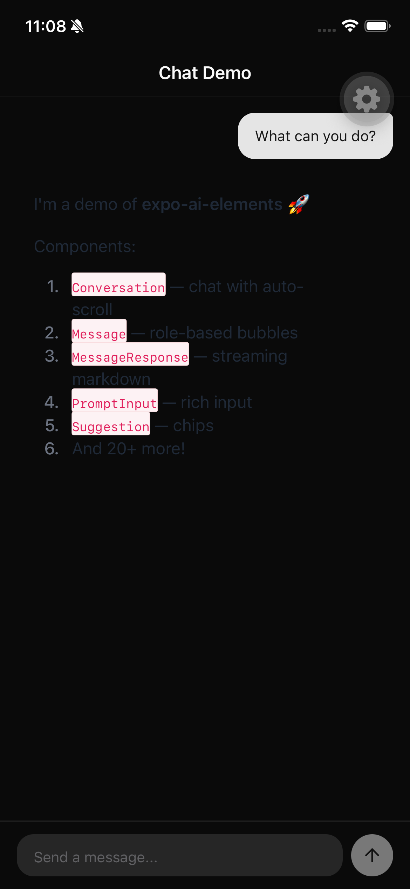
  &nbsp;&nbsp;
  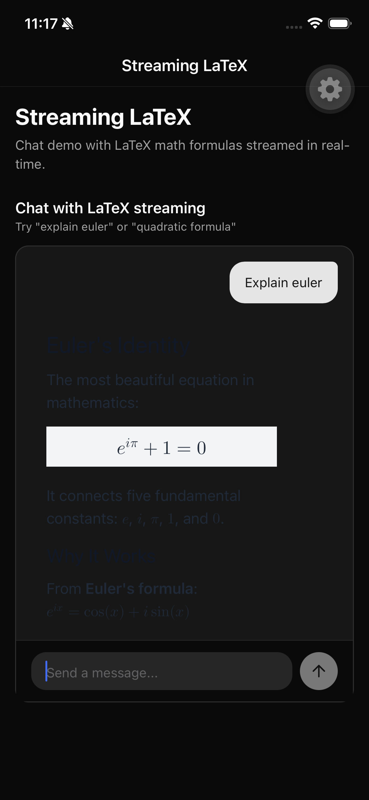
  &nbsp;&nbsp;
  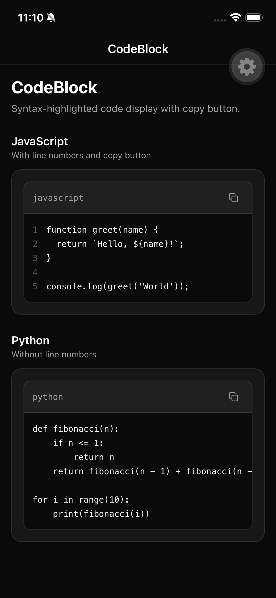
</p>

## Features

- **Streaming markdown** — throttled native rendering with LaTeX math support (`$inline$` and `$$block$$`)
- **25 production-ready components** — chat, code, reasoning, content, input, and utilities
- **Copy-paste architecture** — follows the shadcn/ui pattern, you own every line of code
- **Dark/light mode** — automatic theme support via Uniwind
- **Vercel AI SDK compatible** — works with `useChat` and `useCompletion` hooks

Built with [React Native Reusables](https://reactnativereusables.com) (shadcn/ui for RN) + [Uniwind](https://uniwind.dev) (Tailwind CSS for RN).

## Component Showcase

<table>
  <tr>
    <td align="center">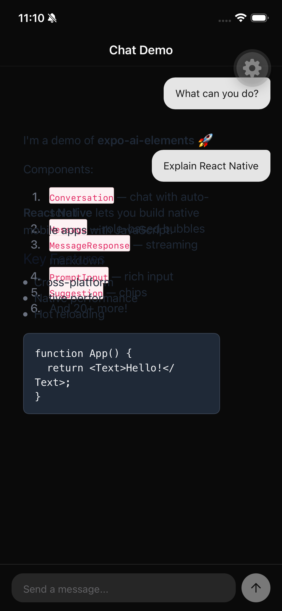<br/><b>Chat</b></td>
    <td align="center">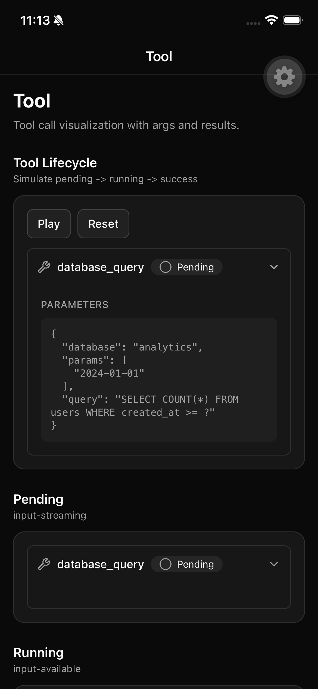<br/><b>Tool Calls</b></td>
    <td align="center">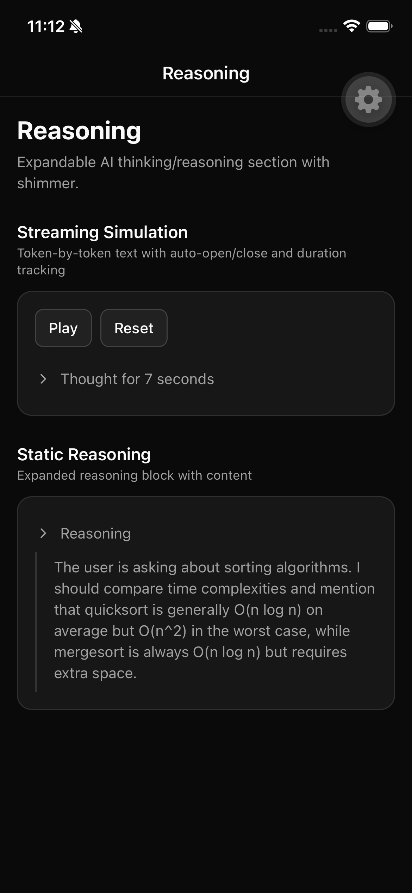<br/><b>Reasoning</b></td>
  </tr>
  <tr>
    <td align="center">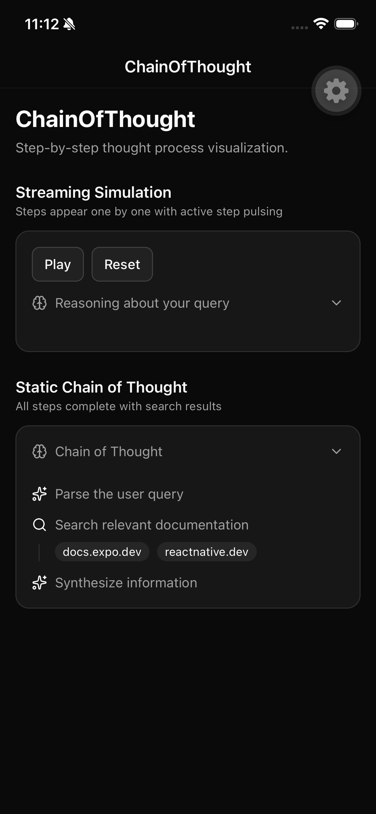<br/><b>Chain of Thought</b></td>
    <td align="center">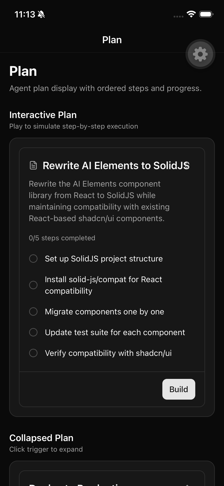<br/><b>Plan</b></td>
    <td align="center">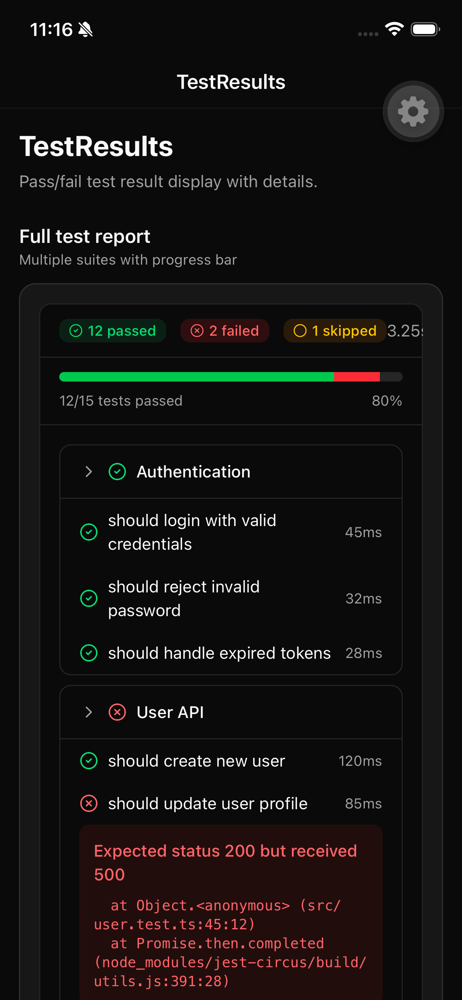<br/><b>Test Results</b></td>
  </tr>
  <tr>
    <td align="center">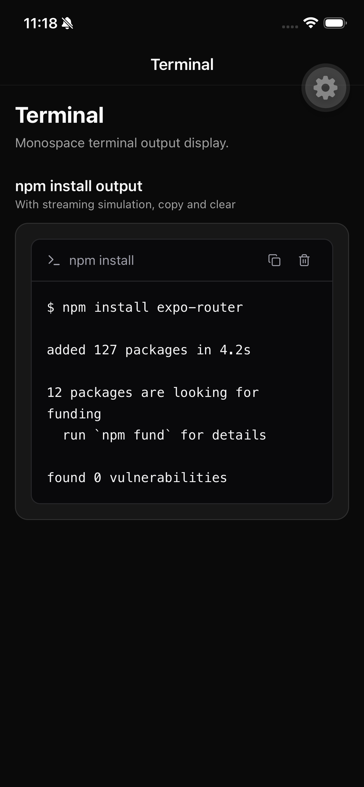<br/><b>Terminal</b></td>
    <td align="center">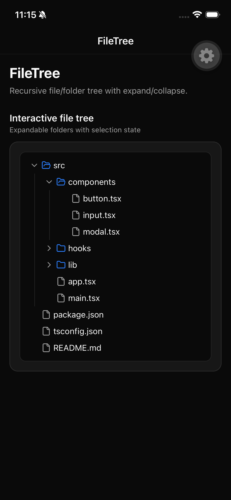<br/><b>File Tree</b></td>
    <td align="center">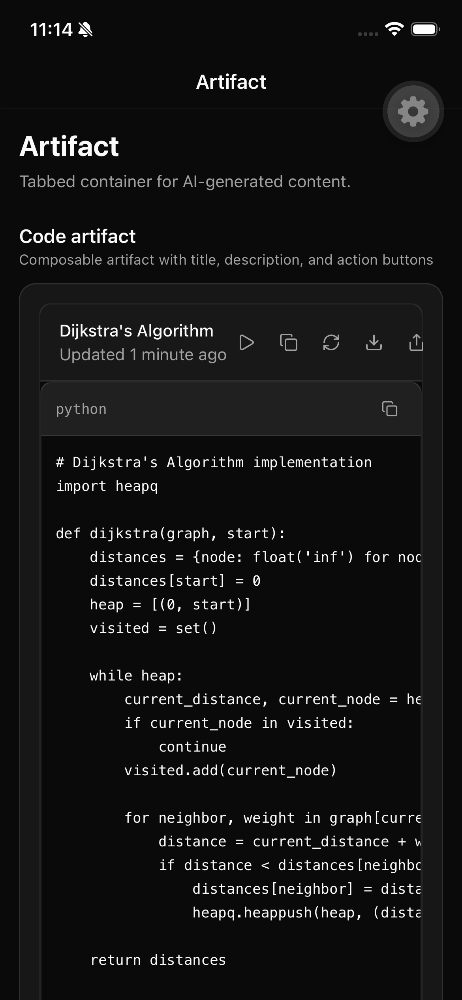<br/><b>Artifact</b></td>
  </tr>
</table>

## Quick Start

### Add Components via CLI (recommended)

```bash
npx @react-native-reusables/cli@latest add https://raw.githubusercontent.com/muratcakmak/expo-ai-elements/main/public/r/conversation.json
npx @react-native-reusables/cli@latest add https://raw.githubusercontent.com/muratcakmak/expo-ai-elements/main/public/r/message.json
npx @react-native-reusables/cli@latest add https://raw.githubusercontent.com/muratcakmak/expo-ai-elements/main/public/r/message-response.json
npx @react-native-reusables/cli@latest add https://raw.githubusercontent.com/muratcakmak/expo-ai-elements/main/public/r/prompt-input.json
```

Browse all available components in the [registry index](https://raw.githubusercontent.com/muratcakmak/expo-ai-elements/main/public/r/registry.json).

### Alternative: npm package

```bash
npm install expo-ai-elements
npx expo install react-native-enriched-markdown react-native-reanimated react-native-gesture-handler react-native-svg lucide-react-native expo-clipboard expo-haptics
```

### Prerequisites

You'll need [Uniwind](https://uniwind.dev) (Tailwind CSS for React Native) and [React Native Reusables](https://reactnativereusables.com) set up in your project.

## Usage

Components follow the **shadcn/ui copy-paste pattern** — you own every line of code:

```tsx
import {
  Conversation, Message, MessageContent, MessageText,
  MessageResponse, PromptInput, Suggestions, Suggestion,
} from 'expo-ai-elements/components/ai';

export default function ChatScreen() {
  const { messages, isLoading, sendMessage } = useChat(); // Vercel AI SDK

  return (
    <>
      <Conversation
        data={messages}
        renderItem={({ item }) => (
          <Message role={item.role}>
            <MessageContent>
              {item.role === 'assistant' ? (
                <MessageResponse isStreaming={isLoading}>
                  {item.content}
                </MessageResponse>
              ) : (
                <MessageText>{item.content}</MessageText>
              )}
            </MessageContent>
          </Message>
        )}
      />
      <PromptInput onSubmit={sendMessage} isLoading={isLoading} />
    </>
  );
}
```

Every component is composable with sub-components for full customization:

```tsx
import {
  CodeBlock, CodeBlockHeader, CodeBlockTitle,
  CodeBlockCopyButton, CodeBlockContent,
} from 'expo-ai-elements/components/ai';

<CodeBlock code={code} language="typescript">
  <CodeBlockHeader>
    <CodeBlockTitle>typescript</CodeBlockTitle>
    <CodeBlockCopyButton />
  </CodeBlockHeader>
  <CodeBlockContent code={code} showLineNumbers />
</CodeBlock>
```

## Components

**25 components** across 6 categories:

| Category | Components |
|---|---|
| **Chat** | Conversation, Message, MessageResponse, Suggestion, Checkpoint, Citation, Streaming LaTeX |
| **Code** | CodeBlock, Terminal, StackTrace, TestResults, SchemaDisplay |
| **Reasoning** | Reasoning, ChainOfThought, Tool, Plan, Task, Agent |
| **Content** | Artifact, FileTree, WebPreview, Attachments |
| **Input** | PromptInput, SpeechInput, OpenInChat |
| **Utilities** | Shimmer |

## Demo App

<p align="center">
  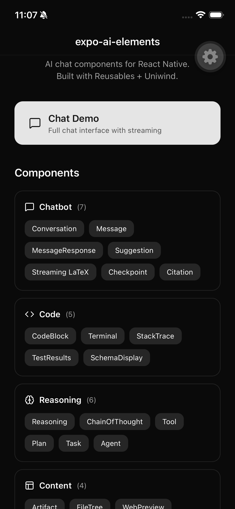
  &nbsp;&nbsp;
  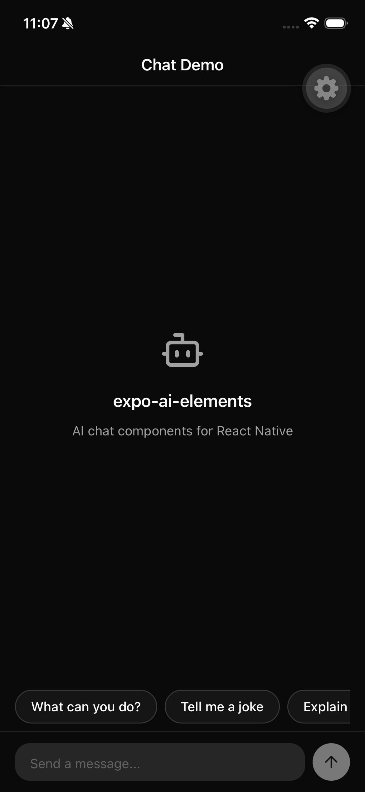
</p>

The repo includes a full demo app with interactive previews for every component plus a chat demo with simulated streaming.

```bash
git clone https://github.com/muratcakmak/expo-ai-elements.git
cd expo-ai-elements
bun install
npx expo run:ios   # or npx expo run:android
```

## Stack

| Layer | Technology |
|---|---|
| **Framework** | Expo SDK 55, React Native 0.83, React 19 |
| **Styling** | Uniwind (Tailwind CSS for RN) |
| **Base UI** | React Native Reusables (shadcn/ui) |
| **Markdown** | react-native-enriched-markdown + react-native-streamdown |
| **Threading** | react-native-worklets 0.7 |
| **AI SDK** | Vercel AI SDK (`ai` + `@ai-sdk/react`) |
| **Animations** | react-native-reanimated 4.3 |
| **Icons** | lucide-react-native |

## Project Structure

```
app/
  _layout.tsx          # Drawer sidebar layout
  index.tsx            # Home screen with component grid
  chat.tsx             # Full chat demo
  [slug].tsx           # Dynamic component preview route
components/
  ai/                  # AI chat components (the library)
  ui/                  # Base UI components (Reusables)
  showcase/            # Sidebar + preview wrappers
demos/                 # Interactive demos for each component
lib/
  fonts.ts             # Platform monospace font config
  component-registry.ts  # Component catalog for sidebar nav
```

## Known Limitations

- **Streaming jank**: `EnrichedMarkdownText` recalculates native layout on every prop change. Updates are throttled to ~80ms to mitigate. The proper fix (`react-native-streamdown` with worklet-based processing) requires `react-native-worklets` bundle mode which needs additional metro configuration. See [worklets bundle mode docs](https://docs.swmansion.com/react-native-worklets/docs/bundleMode/).
- **LaTeX block math** (`$$...$$`) requires `flavor="github"` on `EnrichedMarkdownText`.

## License

MIT
